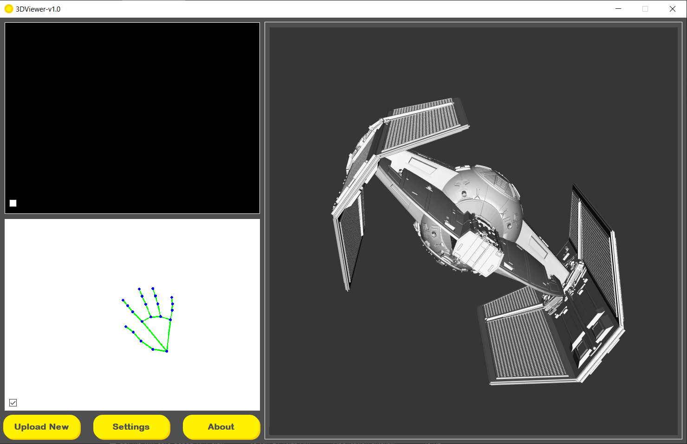

# 3DViewer
3DViewer with controller inputs from camera. Mediapipe is used for detecting hands, vtk library is used 3D viewing and PyQt5 for overall software UI and functioning.

## Steps to use

1. Download the converted executable file from [here](https://drive.google.com/u/1/uc?export=download&confirm=ia7a&id=1SZ8QgYrEKrDLfRGCcm7m_ehaLe6w9qg6).
2. Extract the rar file and open 3DViewer folder and then click on 3DViewer.exe file.
3. This window will appear.

- The top-left window is the Camera Window, where it will show the camera input.  
- The down-left window is the Detection Window, it will show the detections from the camera input (For better results, there shouldn't be light coming from back).
- The big right window is where the 3D model is visible. You can rotate it in 2 axis and scale it.
- Wave/move your hand infront of camera to begin.

4. There are three buttons below the Detection Window.
- Upload: lets you upload .obj files to view.
- Settings: Opens setting window (discussed later).
- About: About me

## Settings
1. After opening the 3DViewer.exe, you can see the Settings button. Click that to open settings.

