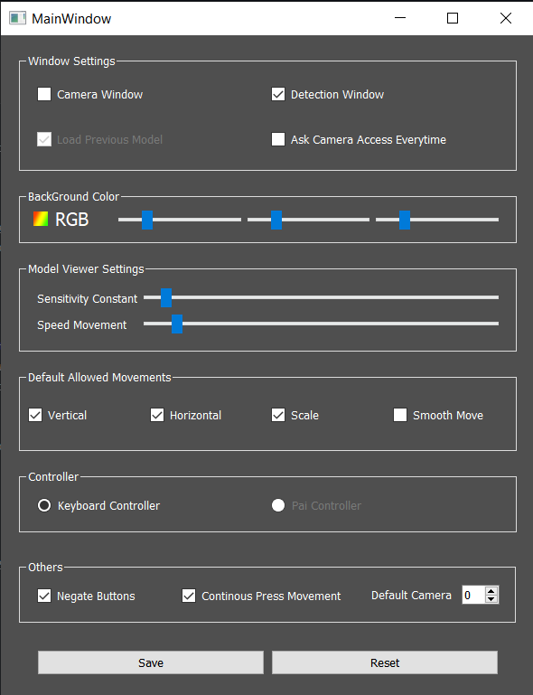

# 3DViewer
3DViewer with controller inputs from camera. Mediapipe is used for detecting hands, vtk library is used 3D viewing and PyQt5 for overall software UI and functioning.

## Steps to use

1. Download the converted executable file from [here](https://drive.google.com/u/1/uc?export=download&confirm=ia7a&id=1SZ8QgYrEKrDLfRGCcm7m_ehaLe6w9qg6).
2. Extract the rar file and open 3DViewer folder and then click on 3DViewer.exe file.
3. This window will appear.

- The top-left window is the Camera Window, where it will show the camera input.  
- The down-left window is the Detection Window, it will show the detections from the camera input (For better results, there shouldn't be light coming from back).
- The big right window is where the 3D model is visible. You can rotate it in 2 axis and scale it.
- Wave/move your hand infront of camera to begin.

4. There are three buttons below the Detection Window.
- Upload: lets you upload .obj files to view.
- Settings: Opens setting window (discussed later).
- About: About me

## Settings
After opening 3DViewer.exe, you can see the Settings button. Click that to open settings.

1. Windows Settings: 
    1. If Camera Window checkBox is enabled, camera input will be displayed inside the 3DViewer window.
    2. If Detection Window checkBox is enabled, Detections from the camera input will be displayer inside the 3DViewer window.
    3. If Ask Camera Access Everytime checkBox is enabled, everytime 3DViewer is opened, it will ask for camera access everytime.
2. BackGround Color Settings:
    1. Changes the background color of the 3D model.
    2. On clicking icon on left of "RGB" will open color picker, it can also be set using the three valueBars of RGB respectively.
3. Model Viewer Settings
    1. Set these two parameters according to your convenience.
4. Default Allowed Movements:
    1. Vertical checkBox if enabled, allows to move the model in horizontal axis.
    2. Horizontal checkBox if enabled, allows to move the model in vertical axis.
    3. Scale checkBox if enebaled, allows to scale the model by changing distance between index and thumb.
    4. If multiple are checked, it allows multiple actions simultaneously.
5. Others:
    1. If u have multiple cameras and want to use any of those, try changing then number of Default Camera.
6. There are some keyboard inputs also that would help to view the model in better ways.
    1. If you just want to move the model vertically, then press V on keyboard once (if Continous Press Movement under Others Settings is diabled). Similarly press H, S and R for horizontal Movement, scale and reseting the action respectively.
    2. If Continous Press Movement is enabled, then the action discussed above works as long as you press the button, once you release, the action resets.
    3. If Negate Button is enabled, then on pressing V, all the actions will be enabled except the vertical movement. And similary for others.

